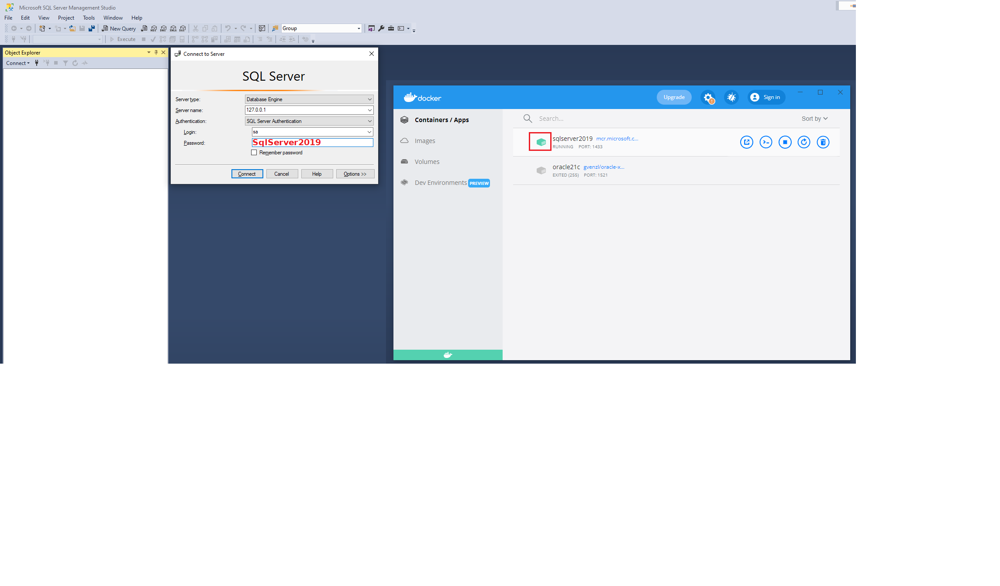

# Installation von SQL Server

### [Zum Video](https://youtu.be/EfZTHVe0Z_c) 

## Docker Image von SQL Server

Die einfachste Möglichkeit, mit SQL Server zu arbeiten, ist das Verwenden des Docker Images. Lade dafür
Docker für dein Betriebssystem von [docs.docker.com](https://docs.docker.com/get-docker/).

Die nachfolgende Anweisung in der Eingabeaufforderung (Konsole unter Windows: Windows-Taste + Eingabe "cmd" + Enter) legt einen Container
mit dem Namen *sqlserver2019* an. Das Passwort wird in *SA_PASSWORD* gesetzt und ist in diesem
Beispiel *SqlServer2019*. Der Benutzer ist *sa*. Das Passwort muss folgender Richtlinie genügen:

> This password needs to include at least 8 characters of at least three of these four categories:
> uppercase letters, lowercase letters, numbers and non-alphanumeric symbols.

```text
docker run -d -p 1433:1433  --name sqlserver2019 -e "ACCEPT_EULA=Y" -e "SA_PASSWORD=SqlServer2019" mcr.microsoft.com/azure-sql-edge
```

Das Dockerimage beinhaltet *Azure SQL Edge*, eine Engine die auf SQL Server basiert und für
IoT Anwendungen gemacht wurde. Die Limitierungen sind für die Ausbildung nicht relevant und
betreffen nur Bereiche für große Serverinstallationen (siehe https://learn.microsoft.com/en-us/azure/azure-sql-edge/features#unsupported-features).
**Das Dockerimage läuft auf allen Plattformen, also auch auf Apple M1 oder M2 Prozessoren mit
ARM Architektur.**

### Starten und Stoppen des Containers

Durch *docker run* wird unser Container bereits gestartet. Aber wie verhält es sich nach einem
Neustart von Windows? Docker Desktop startet automatisch mit
Microsoft Windows, der Container wird allerdings nicht automatisch gestartet.
Daher die zwei folgenden Befehle in der Konsole zum Starten bzw. manuellen Stoppen (wenn notwendig)
des Containers wichtig:

```text
docker start sqlserver2019
docker stop sqlserver2019
```

Natürlich kann mit Docker Desktop der Container ebenfalls gestartet und beendet werden.

> **Hinweis:** Gerade nach dem ersten Start des Containers vergeht etwas Zeit, bis die Datenbank 
> hochgefahren ist. Kontrolliere die Ausgaben in Docker Desktop, indem du auf den Containernamen
> klickst.


## SQL Server Management Studio

Das SQL Server Management Studio kann von https://docs.microsoft.com/en-us/sql/ssms/download-sql-server-management-studio-ssms?view=sql-server-ver16
geladen werden (*Free Download for SQL Server Management Studio (SSMS)*). Gib nach
der Installation im Startmenü *SSMS* ein, es wird dann in der Liste der Programme aufscheinen.

Die Verbindung kann über die IP (127.0.0.1), den User *sa* und das Passwort *SqlServer2019*
erfolgen. **Achte darauf, dass der Container von SQL Server 2019 in Docker Desktop läuft.**




## Weiters Tool zum Betrachten der Datenbanken

- DBeaver: [Information zur Installation und Konfiguration](Dbeaver.md)
