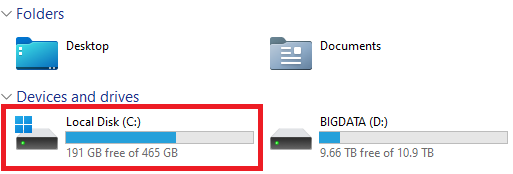
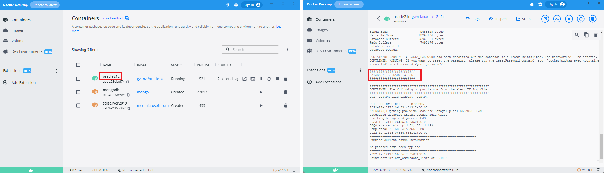
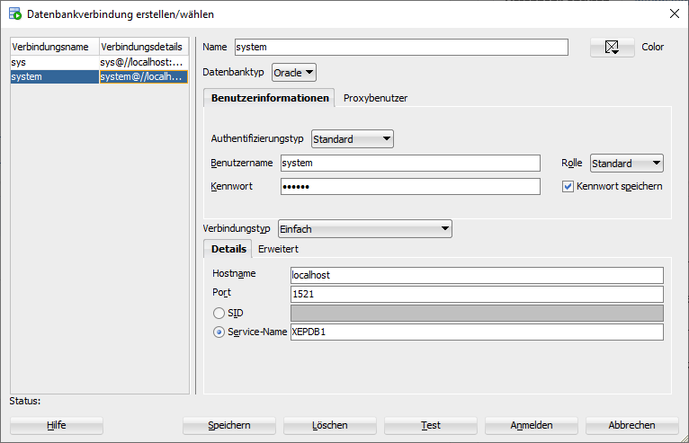

# Docker Container für Oracle 21 XE

Die neueste Express Edition (XE) von Oracle gibt es auch als Docker Container. Lade dafür
Docker für dein Betriebssystem von [docs.docker.com](https://docs.docker.com/get-docker/).

## Vor der Installation zu prüfen

Prüfe vor der Installation, ob **genügend Speicher auf der Systemplatte** (C) frei ist. Die virtuelle
Harddisk wird im Userprofile angelegt und hat - je nach Nutzung - **20 bis 50 GB**.



Achte auch darauf, dass du **keine zusätzliche Virenscanner** wie Avira, ... neben dem Windows Defender
laufen hast. Sie können den Schreibzugriff auf die virtuelle Harddisk sperren und dann wird Docker
einfach stehenbleiben.

## Installation von Docker

### Windows

Für die Installation von Docker Desktop und dem Laden des Containers sind folgende Schritte erforderlich:

- Laden des Linux kernel update packages über den Punkt
  [WSL2 Linux kernel update package for x64 machines](https://learn.microsoft.com/en-us/windows/wsl/install-manual#step-4---download-the-linux-kernel-update-package)
- Laden und Installieren von [Docker Desktop](https://docs.docker.com/get-docker/)

Nach der erfolgreichen Installation wird der Container für Oracle 21 XE mittels der folgenden
Befehle in der Windows Konsole geladen und ausgeführt. Der Container hat rund 3.5 GB.

Der *docker run* Befehl verwendet ein Verzeichnis (*C:/Temp/oracle-home*), um das Homeverzeichnis
zu mappen. Bei anderen Betriebssystemen (macOS, Linux) muss dieser Pfad angepasst werden, da es
dort keine Laufwerke gibt. **Achte darauf, dass vor dem Schließen der Konsole der Befehl auch
abgeschlossen wurde. Das ist daran zu erkennen, dass der Prompt wieder erscheint.**

```text
docker run -d -p 1521:1521 -e ORACLE_PASSWORD=oracle -v C:/Temp/oracle-home:/host --name oracle21c gvenzl/oracle-xe:21-full
```

Die Umgebungsvariable *ORACLE_PASSWORD* setzt das Systempasswort. Da es keine Produktionsdatenbank
ist, verwenden wir zur Vereinfachung *oracle*.

### MacOS (x86 Geräte)

Installiere Docker Desktop von [www.docker.com](https://www.docker.com/products/docker-desktop/).
Achte auf die *Intel Chip* Version. Führe nach der Installation im Terminal den folgenden Befehl aus:

```bash
mkdir $HOME/oracle-home
chmod 777 $HOME/oracle-home
docker run -d -p 1521:1521 -e ORACLE_PASSWORD=oracle -v $HOME/oracle-home:/host --name oracle21c gvenzl/oracle-xe:21-full
docker logs -f oracle21c
```

**Achte darauf, dass vor dem Schließen des Terminals der Befehl auch
abgeschlossen wurde. Das ist daran zu erkennen, dass der Prompt wieder erscheint.** Klicke danach
auf den Namen des Containers in Docker Desktop, um das Log anzusehen. Am Anfang wird die Datenbank
initialisiert. Sie ist erst betriebsbereit, wenn die Meldung *DATABASE IS READY TO USE* erscheint.

### MacOS (M1, M2 Geräte)

Installiere Docker Desktop von [www.docker.com](https://www.docker.com/products/docker-desktop/).
Achte auf die *Apple Chip* Version. Danach installiere - wenn nicht schon
geschehen - [Homebrew](https://brew.sh/), einen Packagemanager für macOS.
Führe danach im Terminal die folgenden Befehle aus.

```bash
brew install colima
colima start --memory 4 --arch x86_64
mkdir $HOME/oracle-home
chmod 777 $HOME/oracle-home
docker run -d -p 1521:1521 -e ORACLE_PASSWORD=oracle -v $HOME/oracle-home:/host --name oracle21c gvenzl/oracle-xe:21-full
docker logs -f oracle21c
```

Der letzte Befehl zeigt das Log des Containers an. Da beim ersten Starten des Containers die Datenbank
noch initialisiert wird, ist es wichtig, diese Initialisierung abzuwarten. Warte, bis
*DATABASE IS READY TO USE* erscheint. Danach kannst du mit CtrL+C (⌃ + C) das Log verlassen.

*Colima* kann x86 Container auf der Apple ARM Plattform emulieren. Daher muss zum Starten des
Containers der Oracle Container mit folgenden Befehlen im Terminal gestartet werden:

```bash
colima start && docker start oracle21c
```

Um die Ressourcen wieder freizugeben, solltest du nach der Arbeit colima mit `colima stop` beenden.

## Starten und Stoppen des Containers

Durch *docker run* wird unser Container bereits gestartet. Aber wie verhält es sich nach einem
Neustart von Windows? Docker Desktop startet automatisch mit
Microsoft Windows, der Container wird allerdings nicht automatisch gestartet.
Daher die zwei folgenden Befehle in der Konsole zum Starten bzw. manuellen Stoppen (wenn notwendig)
des Containers wichtig:

```text
docker start oracle21c
docker stop oracle21c
```

Natürlich kann mit Docker Desktop der Container ebenfalls gestartet und beendet werden.

> **Hinweis:** Gerade nach dem ersten Start des Containers vergeht etwas Zeit, bis die Datenbank 
> hochgefahren ist. Kontrolliere die Ausgaben in Docker Desktop, indem du auf den Containernamen
> klickst. Es muss die Meldung *DATABASE IS READY TO USE!* im Log Fenster erscheinen.



### SQL*Plus 

SQL*Plus ist ein Kommandozeilentool, welches direkt SQL Befehle absetzen kann. Wollen wir als
System User direkt Befehle in der pluggable database absetzen, können wir
mittels *docker exec* das Dienstprogramm *sqlplus* starten. Das Passwort ist *oracle* und wurde
im *docker run* Befehl weiter oben als Umgebungsvariable *ORACLE_PASSWORD* gesetzt.

```text
docker exec -it oracle21c sqlplus system/oracle@//localhost/XEPDB1
```

Wollen wir *systemweite Änderungen* machen, gibt es noch den User *SYS*. Hier können Konfigurationen,
die das ganze System betreffen, gelesen und gesetzt werden. Beachte, dass *oracle* das Passwort
des Users sys ist.

```text
docker exec -it oracle21c sqlplus sys/oracle AS SYSDBA
```

Mit dem Befehl *quit* kann der SQL*Plus Prompt verlassen werden.

### Shell (bash) und Datenaustausch mit dem Host

Wir können auch eine Shell öffnen und Befehle in Linux absetzen:

```text
docker exec -it -u root oracle21c bash
```

Mit *exit* kann die Shell verlassen und zu Windows zurückgekehrt werden. Du kannst auch in
Docker Desktop auf den Button *CLI*, der beim Container angeboten wird, klicken.

Beim Anlegen des Containers mit *docker run* haben wir mit dem Parameter
*-v C:/Temp/oracle-home:/host* einen Ordner angegeben, der auch im Container sichtbar ist.
Nun können wir z. B. in Windows in *C:/Temp/oracle-home* eine Textdatei anlegen. In der bash
ist sie im Homeverzeichnis sichtbar:

```text
bash-4.4$ cd /host
bash-4.4$ ls
test.txt

bash-4.4$ cat test.txt
Das
ist
ein
Test!
```


## Installation von SQL Developer

SQL Developer ist zwar in der virtuellen Maschine integriert, eine Installation unter ihrem
Hostbetriebssystem erlaubt allerdings ein flüssigeres Arbeiten. Dafür verbindet sich SQL Developer
über TCP (Port 1521) zu Ihrer virtuellen Maschine, die natürlich laufen muss.

Sie können SQL Developer direkt von der
[Downloadseite von Oracle](https://www.oracle.com/database/sqldeveloper/technologies/download/) laden.
Die ZIP Datei muss nur entpackt und sqldeveloper.exe gestartet werden. Für den Download ist
eine registrierung bei Oracle nötig.

Zum Anlegen einer Verbindung klicken Sie wieder auf das grüne Plus in der Palette Connections und richten die
Verbindung wie folgt ein:

- Verbindungsname: frei wählbar (z.B. *SchulDb*)
- Benutzername: *system*
- Kennwort: *oracle*
- Service-Name (statt SID): *orcl*

Nach dem Klick auf Test und Save steht die neue Verbindung nun in der Palette Connections zur
Verfügung. Ein Klick auf die Verbindung öffnet das Abfragefenster.




## Weiters Tool zum Betrachten der Datenbanken

- DBeaver: [Information zur Installation und Konfiguration](Dbeaver.md)
